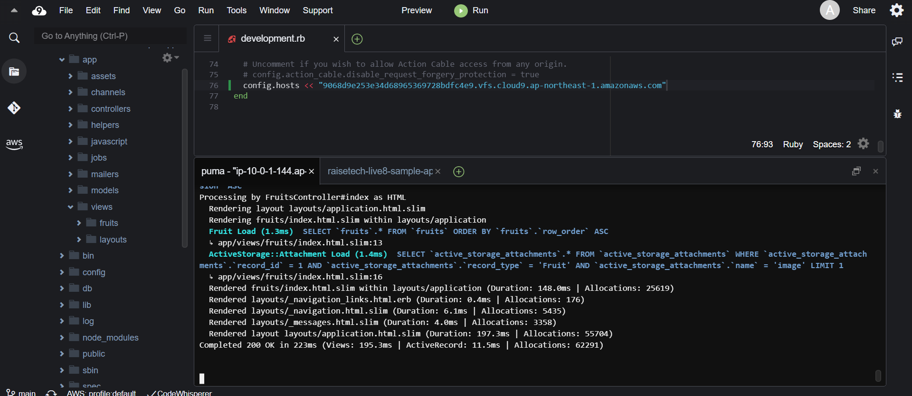

# 第三回課題

* AP サーバーについて調べてみましょう。
* AP サーバーの名前とバージョンを確認してみましょう。
* AP サーバーを終了させた場合、引き続きアクセスできますか？結果を確認して、また AP サー
バーを起動してください。
* DB サーバーについて調べてみましょう。
* サンプルアプリケーションで使った DB サーバー（DB エンジン）の名前と、今 Cloud9 で動作
しているバージョンはいくつか確認してみましょう。
* DB サーバーを終了させた場合、引き続きアクセスできますか？
* Rails の構成管理ツールの名前は何でしたか？確認してみてください。
* 今回の課題から学んだことを報告してください。
* （任意）今回の報告を GitHub の PR で行って、URL を報告してください。

## APサーバー
* Puma 5.6.5
* APサーバーを終了させてブラウザを更新した場合[Oops]の画面が表示された。
* アプリケーション内でのページの動き（更新状況など）が流れていくことが確認できた。
* rails sコマンドとbundle exec rails serverコマンドの違いはgemにrailsのライブラリが入っているかどうかによってかわる
* rails gemが入っていればrailsコマンドが有効になる。

## DBサーバー
* mysql Ver 8.0.3
* DBサーバーをストップした状態でブラウザを更新した場合
* Can't connect to local MySQL server through socket というエラー文が表示される。
* DBサーバー　>　APサーバーという関係であると認識した。
* しかし、相互に起動し、接続しあわないとWebアプリケーションそのものが動くことはない。

## gem
* 外部からのライブラリをインストールする場合、依存関係同士のファイルをライブラリとしてまとめたもの。

## bundle
* gemをバージョンで一括管理を可能にするツールのようなもの。
* プロジェクト内での足並みを揃えるのに大きな助けになる
* bundler=構成管理ツール

## 今回の学び
* 今回はサンプルアプリケーションをとってきて、それのデプロイまでを体験したが、
* これを一から構築する場合、ruby,SQL.railsをインストールして必要ならbundleもインストールするといった手順が必要になる。
* 機会を設けて一度試したいと思う。
* あと、恥ずかしながら動画講座中のconfig,binなどのファイルになにがあるかが分からず、初めは何をしているのかが分からなかった。
* 主に設定等がetcでbinはプログラムのディレクトリ、configは実行環境に関するファイルを格納しているという認識になった。
* 要は、手を動かして触っていくべきだと深く感じた。

